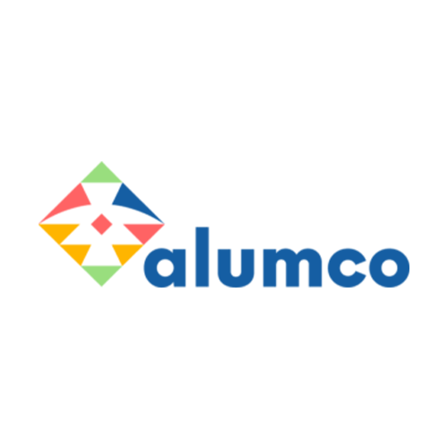

# Plataforma de Capacitación Digital Alumco 🎓

Sistema de Gestión de Aprendizaje (LMS) desarrollado a medida para la ONG Alumco. Esta plataforma está diseñada específicamente para administrar, capacitar y certificar a los colaboradores de ELEAM a lo largo de Chile, proporcionando una experiencia de aprendizaje intuitiva y un panel de administración robusto.



---

## 🚀 Características Principales

### Para los Usuarios (Estudiantes)
* **Autenticación Segura**: Sistema de registro y login con validación estricta de RUT chileno.
* **Panel de Aprendizaje**: Tablero visual interactivo para llevar el registro del avance en las capacitaciones.
* **Cursos Dinámicos**: Soporte para cápsulas de video, material de lectura interactivo, actividades presenciales y Quizzes integrados con calificación automática (mínimo 60% de aprobación).
* **Certificados Digitales Automáticos**: Emisión de diplomas en formato PDF con firma digital del instructor y código Hash QR verificable públicamente.

### Para la Administración
* **Gestión de Sedes y Usuarios**: CRUD completo para administrar centros ELEAM y control avanzado de accesos (estado de usuarios, roles, vencimientos de cuenta).
* **Editor Pro de Cursos**: Constructor de módulos y quizzes integrado para crear capacitaciones sin necesidad de conocimientos técnicos.
* **Dashboard de Métricas**: Indicadores KPI en tiempo real sobre el progreso de las sedes, finalización de cursos y embudos de inscripción.
* **Importación/Exportación Masiva**: Carga de bases de datos de usuarios desde archivos Excel (`.xlsx`) y exportación de reportes de avance completos.

---

## 🛠️ Stack Tecnológico

El proyecto está construido sobre una arquitectura moderna basada en componentes y contenedores:

### Frontend
* **Framework**: React 18 (Vite)
* **Lenguaje**: TypeScript
* **Estilos**: Tailwind CSS + Componentes Radix UI
* **Iconografía y Feedback**: Lucide React + Sonner (Toasts)

### Backend
* **Entorno**: Node.js + Express
* **Base de Datos**: PostgreSQL
* **Autenticación**: JSON Web Tokens (JWT)
* **Generación de PDFs**: PDFKit

### Infraestructura
* **Contenedores**: Docker & Docker Compose
* **Gestión de Archivos**: Multer + XLSX para procesamiento de hojas de cálculo

---

## ⚙️ Instalación y Ejecución Local

La forma más sencilla de ejecutar este proyecto es mediante Docker.

### 1. Requisitos Previos
- Instalar [Git](https://git-scm.com/)
- Instalar [Docker Desktop](https://www.docker.com/products/docker-desktop/) (Asegúrate de que el motor de Docker esté corriendo).

### 2. Clonar el repositorio
```bash
git clone <URL_DEL_REPO>
cd alumco_ong
```

### 3. Configurar Variables de Entorno
Copia los archivos de ejemplo para crear tu configuración local:
```bash
# En Windows (CMD o PowerShell)
copy backend-alumco\.env.example backend-alumco\.env
copy frontend-alumco\.env.example frontend-alumco\.env

# En Linux/Mac
cp backend-alumco/.env.example backend-alumco/.env
cp frontend-alumco/.env.example frontend-alumco/.env
```

### 4. Ejecutar el Proyecto
En Windows, simplemente haz doble clic en el script proporcionado o ejecútalo desde consola:
```bat
iniciar_proyecto.bat
```
*(Selecciona la opción 1 para iniciar todos los contenedores).*

Alternativamente, si estás en otro sistema operativo o prefieres usar Docker manualmente:
```bash
docker compose up -d --build
```

**La base de datos se inicializará automáticamente** con el esquema estructural correcto gracias al script interno de PostgreSQL.

### 5. Acceder a la plataforma
* **Aplicación Web**: http://localhost:5173
* **API Backend**: http://localhost:3000

---

## 🔐 Primeros Pasos y Administración

Por medidas de seguridad, todos los usuarios nuevos que se registren tendrán el estado de `"Pendiente"`. Para activar a tu primer administrador:
1. Regístrate normalmente en la plataforma desde el Frontend.
2. Ingresa a la base de datos PostgreSQL local (`localhost:5432`) o utiliza la terminal de Docker.
3. Cambia tu propio estado a `"activo"` y agrega tu ID a la tabla `usuario_roles` con el rol `admin`.
4. A partir de ese momento, podrás gestionar todas las futuras solicitudes directamente desde la interfaz del Dashboard Administrativo.

---

## 📦 Estructura del Repositorio

* `backend-alumco/`: Código fuente de la API Node.js.
  * `src/routes/` y `src/controllers/`: Lógica de endpoints.
  * `src/services/`: Lógica pesada (Generación de PDFs, Excel, etc).
  * `alumco_schema_BDD_postgre.sql`: Estructura base de la DB.
* `frontend-alumco/`: Aplicación React (SPA).
  * `src/app/pages/`: Pantallas principales de la plataforma.
  * `src/app/components/`: Componentes UI reutilizables (Botones, Tablas, Modales).
* `docker-compose.yml`: Orquestador de contenedores (Frontend, Backend y DB).
* `iniciar_proyecto.bat`: Script de utilidad para Windows.

---

*Desarrollado con ❤️ para ONG Alumco.*
